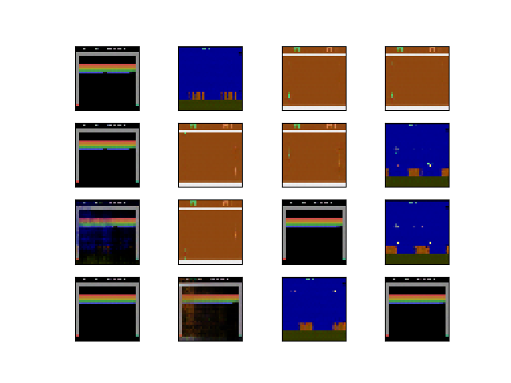
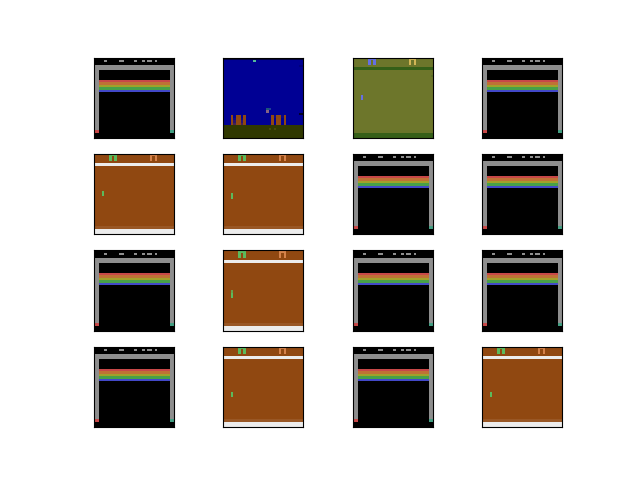

# Atari-WGAN
Implementation of WGAN to generation of Atari Games Images.

# Fake Images

# Real Images

# Reference and Ideas:
- https://github.com/satwikkansal/atari_gan
- https://github.com/kuc2477/pytorch-wgan-gp
